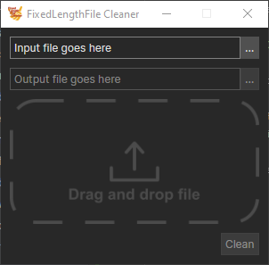
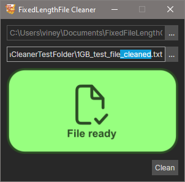
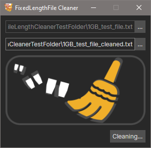
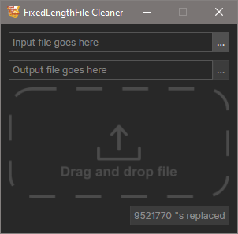
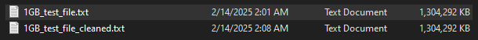

This application was made to streamline the workflow of my beloved uncle.

He performs data processing for a mailing company, part of his workflow is transforming fixed length files into .csv 
format.

# What's his problem?
Every time he gets a fixed length file, he has to open it up and replace any the quotation marks `"` with spaces, since 
they cause an issue when being converted to `.csv`

## FixedFileLength Cleaner
I told him I'd make him a simple app that he can use to do this automatically. The features requested were:
- Select a file to clean
    - Drag and drop preferred
- Output the fixed file into the same directory.
    - He suggested it could be the same file name with "\_cleaned" suffixed.

Short and simple idea

## Result
Made a portable app that streamlines this process. 

# How to use:
1. Select a file as the input. You can use the "..." button, or drag and drop the file onto
   the application window.  

2. Choose where the file will be saved. By default, this is the same location as the input file, with the suffix 
"_cleaned" added.    

3. Press the "Clean" button to begin processing the file.  

4. The UI will update to tell you how many characters were replaced.  

5. A version of your input file with its quotation marks replaced with spaces will be written to the disk.  
