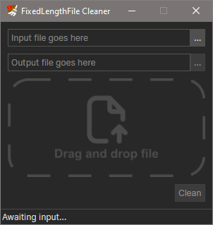
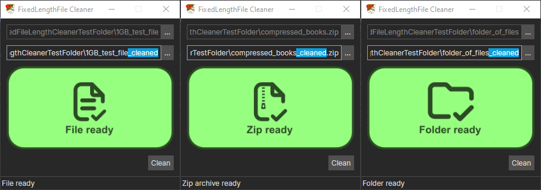
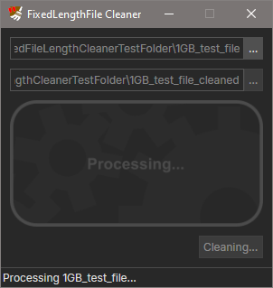
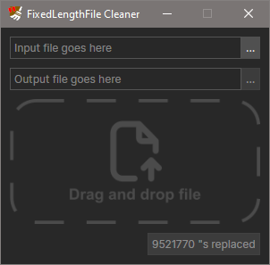
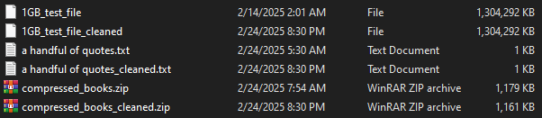

# FixedLengthFile Cleaner

## What is it?

An application that facilitates find/replace operations in ASCII text files.  
Multi-platform and portable -- all critical files are in the same directory as the `.exe`.

<ins>**Note:** Only supports replacing </ins>`"`<ins> with ` ` </ins>(quotes with spaces)<ins> at the moment.</ins>

## Why?

1. Faster, more reliable, and less resource intensive than a text editor.
1. Supports files too large to open in a text editor.
1. To make a great open-source app specifically for finding/replacing text, then ~~ruin it with feature creep~~ _make it even
   better than other freeware alternatives._
1. Cursed with a surplus of free time

## How to use:

1. Select a file as the input. You can drag and drop the file onto the application window, or use the "..." button to
   open a system file dialog.  
   
2. Choose where the file will be saved. By default, this is the same location as the input file, with the suffix
   "_cleaned" added.    
   
3. Press the "Clean" button to begin processing the file.  
   
4. The UI will update to tell you how many characters were replaced.  
   
5. Enjoy your new file with its quotation marks replaced with spaces.  
   

## Todo:

### Up next:

- [x] Add settings view
    - [ ] Support custom string find/replace
        - [ ] Support multiple find/replace patterns
    - [ ] Support pattern matching file exclusion
    - [x] Support custom (or no) suffixes for outputs

### Eventually:

- Support saving profiles
- Add verbose view for all status updates for the current file

### Maybe:

- Support UTF-8 and UTF-16
- Allow counting instances of a string before committing to a write operation.
- [Implement file picker that supports selecting both files and folders](https://github.com/AvaloniaUI/Avalonia/discussions/12771)
- Check that disk has enough space for any temporary storage requirements

___

## Why'd I make this?

This application was made to streamline the workflow of my beloved uncle.

He performs data processing for a mailing company, part of his workflow is transforming fixed length files into .csv
format.

## What's his problem?

Every time he gets a fixed length file, he has to open it up and replace any the quotation marks `"` with spaces, since
they cause an issue when being converted to `.csv`

## FixedLengthFile Cleaner

I told him I'd make him a simple app that he can use to do this automatically. The business requirements were:

- Select a file or zip archive to clean
    - Drag and drop preferred
- Output the fixed file into the same directory.
    - He suggested it could be the same file name with "\_cleaned" suffixed.

Short and simple idea

## Result

Made a portable app that streamlines this process.